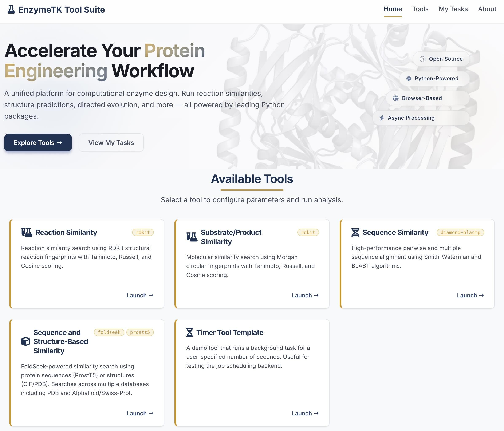
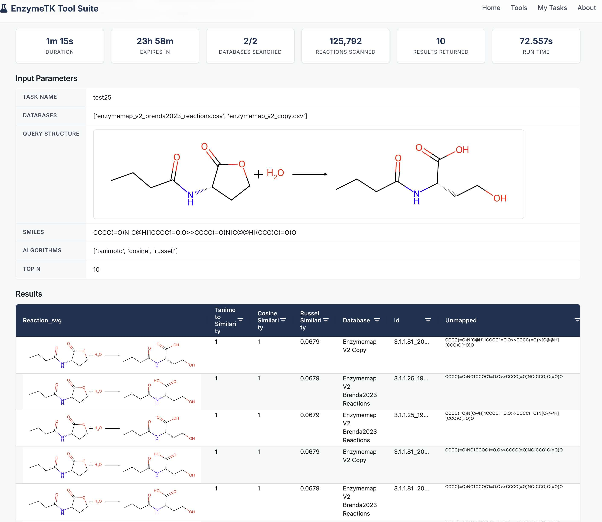

# SSEC-JHU EnzymeTK Tool Suite

[](https://github.com/ssec-jhu/enzyme-tk-app/actions/workflows/ci.yml)
[](https://ssec-jhu-enzyme-tk-app.readthedocs.io/en/latest/?badge=latest)
[](https://codecov.io/gh/ssec-jhu/enzyme-tk-app)
[](https://github.com/ssec-jhu/enzyme-tk-app/actions/workflows/security.yml)
[](https://doi.org/10.5281/zenodo.14052740)


A web application for protein engineering workflows, built with [Dash](https://dash.plotly.com/) (Plotly) and backed by [Celery](https://docs.celeryq.dev/) for asynchronous job processing. It provides a suite of bioinformatics tools that scientists can launch from the browser and monitor through a job-management dashboard.

**Try it online:** <https://enzyme-tk-web.victoriouscliff-65afb037.eastus.azurecontainerapps.io> — no install needed.
To run it on your own machine, start at [Quickstart](#quickstart).


## Available Tools

| Tool | Description | Key Libraries |
|------|-------------|---------------|
| **Reaction Similarity** | Reaction similarity search using RDKit structural reaction fingerprints | `rdkit` |
| **Substrate/Product Similarity** | Molecular similarity search using Morgan circular fingerprints with Tanimoto, Russell, and Cosine scoring | `rdkit` |
| **Sequence Similarity** | Protein sequence similarity search using DIAMOND BLASTp. Searches one or more reference sequence databases, merged into a single index so hits are ranked globally | `diamond-blastp` |
| **Sequence and Structure-Based Similarity** | FoldSeek-powered similarity search using protein sequences (ProstT5) or structures (CIF/PDB). Searches across multiple databases including PDB and AlphaFold/Swiss-Prot | `foldseek`, `prostt5` |
| **Func-E Activity Prediction** | Scores (enzyme, reaction) pairs with an ensemble of four attention models — one per EC level. Encodes the query reaction at run time and ranks a pre-encoded protein embedding database by predicted activity | `torch`, `rxnfp`, `unimol` |
| **Timer Tool Template** | A demo tool for testing the job scheduling backend | — |

> **Func-E scores any valid reaction SMILES** — you do not need a pre-computed pair. A
> dot-joined side (`A.B>>C`) works too, so multi-substrate reactions are fine; leaving
> groups are still better left out. On the **protein** side it only ranks enzymes that are
> already in a `sequence_embeddings/` table — the shipped `enzymes_demo_set.pkl` holds 100, and
> you add your own with `build_enzyme_db.py` (see [Data Directories](#data-directories)). Func-E
> also needs the weights under `data/unimol_weights/` and `data/funce_models/`; without them its
> card shows a red **"Missing data"** badge and a line naming what to download, and its **Run**
> button stays disabled with the same reason shown in the form.




## Prerequisites

- **Docker** with Compose v2 (`docker compose`, not `docker-compose`). Nothing else — no local Python, no conda env.
- **~8 GB RAM** free for the containers. A Func-E job alone budgets ~3 GB.
- **Disk:** ~5 GB for the image. The demo reference data ships in the repo, so nothing more is needed to run four of the six tools; the other two want ~4.2 GB of model weights (~5.6 GB briefly, while the Func-E archive and its contents coexist during unpacking), and the full reference set is ~20 GB. See [Data Directories](#data-directories).


## Quickstart

**1. Clone the repository**

```bash
git clone https://github.com/ssec-jhu/enzyme-tk-app
cd enzyme-tk-app
```

**2. Download model weights — optional, now or later**

Demo sets ship in the repo, so four of the six tools run straight from a clone with worked examples
that return real hits: **Reaction Similarity**, **Substrate/Product Similarity**,
**Sequence Similarity** and the **Timer Tool Template**.

**Just trying it out?** Skip to step 3.

**Want all six tools? (~4.2 GB)** — **Sequence and Structure-Based Similarity** (ProstT5, ~2 GB) and
**Func-E** (UniMol weights and ensemble checkpoints, ~2.2 GB) need weights too large for git.
Without them those two cards show a red **"Missing data"** badge naming what to download and their
**Run** button is disabled — the forms still open and say why.

```bash
# One time: build the data-prep image. Separate from the app — docker compose never uses it.
docker build -t etk-db-build scripts/db_build
```

```bash
# Download the weights. /app is the script, /data is the app's own data directory, so files land
# where the app reads them. Run from the repo root, or $(pwd) points both mounts somewhere else.
docker run --rm -v "$(pwd)/scripts/db_build:/app" -v "$(pwd)/enzyme_tk_app/app/data:/data" etk-db-build
```

**Want the full reference databases? (~20 GB total, and much longer)** — adds the FoldSeek `PDB`
(~6.4 GB) and `AFDB_SWISSPROT` (~3.9 GB) databases, the full 62,896-reaction EnzymeMap CSV
(~130 MB), and the ESM3 weights `build_enzyme_db.py` needs (~5.4 GB). **No tool needs any of it** —
the demo sets already give each of them something to search.

```bash
# Everything. Same two mounts; naming `download_data.py --full` replaces the image's default.
docker run --rm -v "$(pwd)/scripts/db_build:/app" -v "$(pwd)/enzyme_tk_app/app/data:/data" etk-db-build download_data.py --full
```

Run either whenever you like — reload the page afterwards and the cards update, no restart. No
Hugging Face account or token needed; finished units are reused, so re-running is cheap and safe to
interrupt. See [`scripts/db_build/`](scripts/db_build/README.md) for single units and where the data
comes from.

**3. Start the app**

```bash
# --build rebuilds the app image; drop it on later runs for a faster start.
docker compose up --build
```

**4. Open <http://localhost:8050>**

That's it. This starts four services — the web server, Redis, 3 Celery workers, and a Celery
`beat` scheduler — everything needed to submit and run jobs.

```bash
docker compose up --build -d     # detached: runs in the background, terminal stays free
docker compose down              # stop
docker compose down -v           # stop and delete job results
```


## Using the App

1. **Pick a tool.** The home page shows a card per tool; **Tools** in the navbar jumps to
   them. Click **Launch →** to open its form.
2. **Fill in the form.** Give the job a **Task Name** (required — it is how you find the job
   later), paste or upload your query, and pick which reference **Databases** to search. Every
   database is selected by default and they are merged into one ranked result. Most forms have
   an **example** picker that fills every field including the name, so you can run one
   immediately.
3. **Submit.** A green confirmation shows a short job ID — hover it for the full value —
   and links straight to My Tasks; the job runs in the background, so you can close the tab.
4. **Watch it in [My Tasks](http://localhost:8050/my-tasks).** The table lists every job this
   browser has submitted, with its tool, status, and timestamps. Jobs are kept for 24 hours.
5. **View results.** Click into a finished job for summary stat cards, the parameters you
   submitted, and a sortable results table. **Download CSV** exports it. Where a result has a
   structure image, clicking it opens your query and the hit side by side.




## Data Directories

`docker-compose.yml` bind-mounts `./enzyme_tk_app/app/data` read-only at `/app-data` for both
`web` and `worker`. A tool whose directory is missing still loads and its form still opens: the
card shows a red **"Missing data"** badge plus a line naming the path to download, and the form's
**Run** button is disabled with the same reason in it. A file that is *present but unusable* — a
`data/sequences/` CSV without the required columns — is a different case: it is skipped, the card
says **"N file(s) skipped"** in amber, and the tool runs on the databases that are left. Either
way the app does not crash.

**Demo sets ship in the repo** (~1 MB, the `*_demo_set` files below). Each is a strict
**row-subset of the full reference file, copied verbatim** — same columns, same values, no
generated data — chosen so that every example the tool ships returns real hits. They exist so a
clone is runnable immediately; they are not meant to be scientifically complete. The large sets
they are drawn from are **gitignored** — put them there with
[`scripts/db_build/`](scripts/db_build/README.md), and both the demo set and your own data will be
offered side by side in every Databases dropdown.

Because the mount is read-only, nothing here can be regenerated by the running app —
[`scripts/db_build/`](scripts/db_build/README.md) fills it instead, writing **straight into
this directory**, so there is nothing to copy afterwards. Two scripts in one Docker image:
`download_data.py` fetches the public weights and structure databases (none of them gated —
no Hugging Face account, token or login), and `build_enzyme_db.py` turns **your own** sequence
file into a FoldSeek database plus an embeddings pickle. The **Supplied by** column says
which. `report()` runs at the end of every `download_data.py` invocation, so naming any single unit
gives you an inventory: one `OK`/`MISSING` line per row below, plus one for the ESM3 build cache.
A `--full` run also leaves that cache here as a hidden `.hf_cache/` (~5.4 GB, build time only,
never read by the app).

| Directory | Used by | Supplied by | Contents |
|-----------|---------|-------------|----------|
| `sequences/` | Sequence Similarity | **Repo** (`enzymes_demo_set.tsv`, 100 rows) + you | Reference protein tables — CSV or TSV, plain or gzipped (`.csv`, `.tsv`, `.csv.gz`, `.tsv.gz`), each with an `Entry`, `Sequence`, and `EC number` column, and each shown by its exact filename, extension included. Any other column is metadata: the app never enumerates it and passes it straight through to the results grid — except an optional `Cofactor` column, whose UniProt annotations are offered as a filter and shown in the grid as plain names (`Mg(2+); Mn(2+)`). A file missing a required column is **not** offered in the dropdown — the tool card names it and the columns it lacks instead |
| `reactions/`, `structures/` | the other similarity tools | **Repo** (`enzymemap_demo_set.csv`, 110 rows; the three sample `structures/`); `download_data.py --full` for the full 62,896-reaction EnzymeMap set (~130 MB); or your own | Reference CSVs and sample CIF/PDB files — every CSV becomes an option in the tool's database dropdown, shown by its exact filename, extension included |
| `foldseek_db/` | Sequence and Structure-Based Similarity | **Repo** (`enzymes_demo_set/`, built from the 100 demo sequences); `download_data.py --full` for `PDB` (~6.4 GB) and `AFDB_SWISSPROT` (~3.9 GB); `build_enzyme_db.py` for one built from your own sequences | One subdirectory per FoldSeek database (`PDB`, `AFDB_SWISSPROT`, …), each shown by its folder name |
| `foldseek_models/weights/` | Sequence and Structure-Based Similarity | `download_data.py` | ProstT5 weights for sequence-to-structure prediction — `prostt5-f16.gguf` (~2 GB) |
| `sequence_embeddings/` | Func-E Activity Prediction | **Repo** (`enzymes_demo_set.pkl`, the same 100 sequences); `build_enzyme_db.py` for your own | Pre-encoded protein embedding tables — at least one `.pkl`, each with `Entry`, `Sequence` and `esm3_mean`. Named for the data rather than a tool: any tool needing protein embeddings reads these. Columns are **not** checked at discovery (a pickle has no header-only read) — a malformed one is skipped and named in the job's **Databases Skipped** card |
| `funce_models/` | Func-E Activity Prediction | `download_data.py` (minimal tier) — the `data_funce.zip` archive (~1.35 GB) from the project's Hugging Face dataset, unpacked here | The four EC-level checkpoints, `run_easy_0-50_ESRP_{1..4}_model_1_500000_{conf.pkl,checkpoint.pth}` (~925 MB — the only eight files the app reads). The archive also unpacks the `_history.pkl` / `_optimizer.pkl` from the same training run, so the directory settles at ~1.57 GB across 16 files |
| `unimol_weights/` | Func-E Activity Prediction | `download_data.py` | The UniMol v2 164M checkpoint at `modelzoo/164M/checkpoint.pt` (~660 MB), used to embed the query reaction's substrate and product. Named for the model, not for its reader. The exact checkpoint path is checked, not just the directory: the mount is read-only, so a wrong layout cannot heal itself with a download |

Every database-backed tool selects **multiple** databases at once (all of them by default)
and merges the selections into one search, so a directory holding a single file makes the
multi-select indistinguishable from a single-select. The shipped demo sets are what makes that
visible on a fresh clone, and once you add the full sets they sit beside them in the same
dropdown — which is the cheapest way to exercise multi-database behaviour. A database that cannot be read is skipped
and named in a **Databases Skipped** stat card; the job only fails if *every* selection is
unreadable.


## FAQ

### Where do the model weights and reference databases come from?

Run `download_data.py` from [`scripts/db_build/`](scripts/db_build/README.md) — one Docker image, no
Hugging Face account or token, everything written straight into `enzyme_tk_app/app/data/` so there is
nothing to copy afterwards. With no arguments it fetches the **minimal** set: the ProstT5, UniMol and
Func-E weights (~4.2 GB), which is everything the shipped demo sets cannot supply. `--full` adds the
FoldSeek `PDB` and `AFDB_SWISSPROT` databases, the ESM3 snapshot the builder below needs, and the
full EnzymeMap reactions CSV, bringing the total to ~20 GB; naming a unit (`prostt5`, `unimol`,
`funce`, `reactions`, `pdb`, `afdb`, `esm3`) runs just that one. The Func-E checkpoints and the
EnzymeMap reference come from the project's own dataset at
[`arianemora/enzyme-tk`](https://huggingface.co/datasets/arianemora/enzyme-tk); the rest come from
their upstreams. Its closing `report()` prints `OK`/`MISSING` for every data item the app looks
for, on every run.

### How do I build a FoldSeek database or an embeddings table from my own sequences?

Use `build_enzyme_db.py` from the same folder. It takes one CSV or TSV (plain or gzipped) with `Entry`
and `Sequence` columns and writes either or both artifacts directly where the tools read them — a
FoldSeek database in `data/foldseek_db/<name>/` and an ESM3 embeddings pickle at
`data/sequence_embeddings/<name>.pkl`, both named after the input file. That is how the shipped
`enzymes_demo_set/` and `enzymes_demo_set.pkl` were made, from `data/sequences/enzymes_demo_set.tsv`.
Drop your file in that folder (or in `data/sequences/`), point `INPUT_FILE` at its name, and run.
It **downloads nothing**: it needs ProstT5 for the database and ESM3 for the embeddings, and stops
telling you to run `download_data.py` if either is absent. See that folder's
[README](scripts/db_build/README.md) for the full steps, including the GPU build and the memory ceiling
on long proteins.

### My jobs disappeared / the results page 404s

Job metadata is kept in Redis for **24 hours**, after which the job and its output files are
swept. `docker compose down -v` deletes them immediately. Both windows are configurable — see
the [Deployment Guide](docs/deployment-guide.md#environment-variables).

### A tool card says "Missing data" or "N file(s) skipped"

**"Missing data"** (red) means the tool cannot run: its model weights are not in
`enzyme_tk_app/app/data/`. On a fresh clone that is **Sequence and Structure-Based Similarity** and
**Func-E** — the demo sets cover every other tool's data. The card names the missing path under the
badge, the badge's tooltip lists every item, and the tool's **Run** button is disabled with the same
reason shown in the form. Get the weights with step 2 of the [Quickstart](#quickstart).

**"N file(s) skipped"** (amber) means the opposite — the tool runs fine, but something in `data/` is
unusable and was left out. That is a file in `data/sequences/` missing one of the required `Entry`,
`Sequence`, `EC number` columns; the tooltip names the file and the columns. Downloading data does
not fix it — fix the file's header, or remove it.


## Documentation

| Guide | For |
|-------|-----|
| [Developer Guide](docs/developer-guide.md) | Adding a tool, conventions, callbacks, results pages, tests |
| [Deployment Guide](docs/deployment-guide.md) | Environment variables, secrets, TLS, volumes, GPU builds, Azure |
| [Admin Login](docs/admin-login.md) | The `/admin` dashboard's auth flow and security model |
| [Data Prep](scripts/db_build/README.md) | Downloading reference data and building databases from your own sequences |

New tools are auto-discovered — add a sub-package under `enzyme_tk_app/app/tools/` and it
appears on the home page automatically. There is no central registry file to edit.


## Contributing, License & Citation

Contributions are welcome — see [CONTRIBUTING.md](CONTRIBUTING.md) for the fork-and-PR
workflow and [CODE_OF_CONDUCT.md](CODE_OF_CONDUCT.md). Project conventions that both human and
AI contributors follow live in [AGENTS.md](AGENTS.md).

Licensed under the terms in [LICENSE](LICENSE). If you use this software in published work,
please cite it via its DOI: [10.5281/zenodo.14052740](https://doi.org/10.5281/zenodo.14052740).
