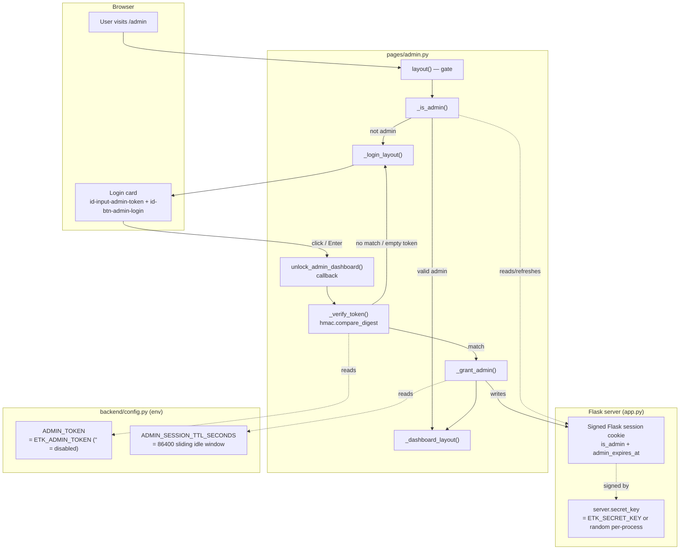
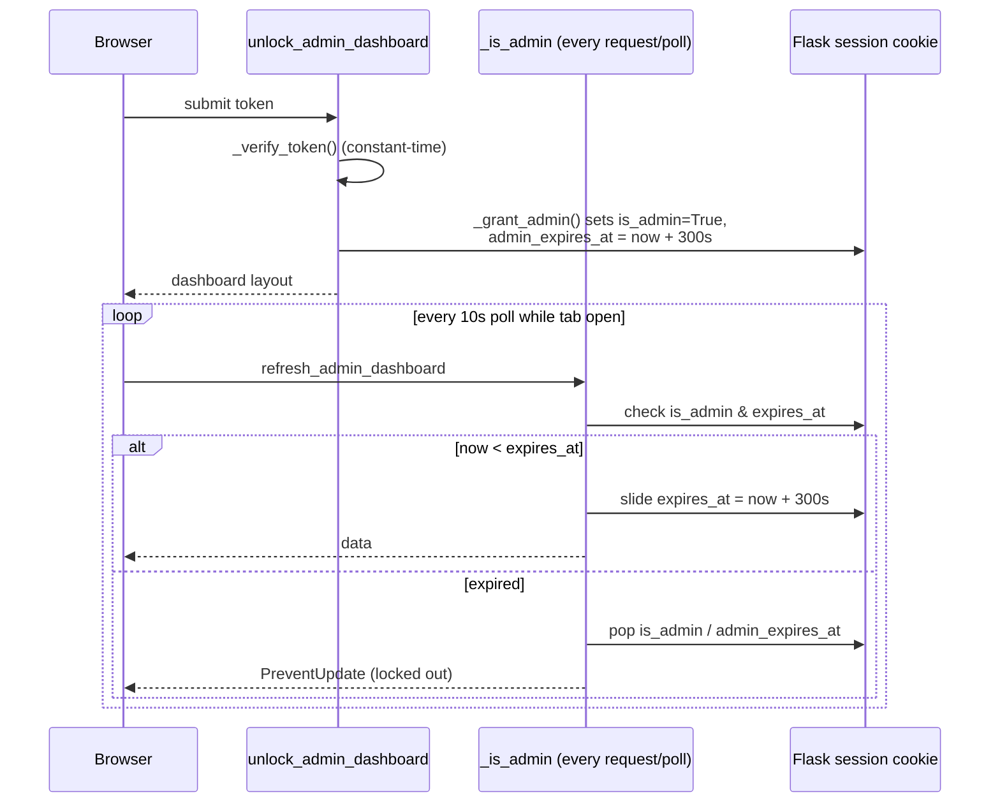

# Admin Login — Architecture & Dev Notes

The hidden `/admin` dashboard is gated behind a shared token. This document
explains how authentication, session state, and the idle timeout work.

## Architecture Diagram

## Idle-Timeout Lifecycle

## Dev Notes

### Two independent secrets (both env-only, never committed)

- `ETK_ADMIN_TOKEN` → `config.py` `ADMIN_TOKEN` — the password the user types.
  Empty default = **fail-closed**: login can never succeed.
- `ETK_SECRET_KEY` → `SECRET_KEY` — signs the Flask session cookie so the
  `is_admin` flag cannot be forged. Unset → random per-process key in `app.py`
  (dev convenience; admins are logged out on restart).

### Auth flow (all in `pages/admin.py`)

1. `/admin` is **not** in the navbar — discoverable only by URL.
2. `layout()` calls `_is_admin()` and renders `_dashboard_layout()` or
   `_login_layout()`.
3. Submitting the token fires `unlock_admin_dashboard` (button click `n_clicks`
   or Enter `n_submit`).
4. `_verify_token()` uses `hmac.compare_digest` (constant-time, avoids timing
   attacks) and rejects when `ADMIN_TOKEN` is empty.
5. On success `_grant_admin()` writes `is_admin=True` and `admin_expires_at`
   into the signed Flask `session`.

### Sliding idle timeout

- `ADMIN_SESSION_TTL_SECONDS` (default 300s). Every authenticated check —
  including the dashboard's 10s poll — pushes `admin_expires_at` forward.
- When the tab closes, polling stops and access lapses after the window.
  `_is_admin()` pops the flags once `time.time() >= admin_expires_at`.
- The cookie is intentionally a **browser-session cookie** (not permanent) — it
  clears on browser close.

### Security posture

- UI hiding is never the protection boundary. Every destructive callback
  (`refresh_admin_dashboard`, cancel/clear/purge) re-calls `_is_admin()`
  server-side and `raise PreventUpdate` if not admin.
- Fail-closed by default: no token configured → dashboard unreachable, which is
  the safe default for a public codebase.

### Tests

`tests/test_admin.py` patches `ADMIN_TOKEN`, asserts empty-token denial,
constant-time match, `is_admin`/`admin_expires_at` session writes, idle expiry,
and the sliding-window refresh.

## Key File References

| Concern | Location |
| --- | --- |
| Login page, callbacks, auth helpers | `enzyme_tk_app/app/pages/admin.py` |
| Secrets & TTL config | `enzyme_tk_app/app/backend/config.py` |
| Flask `secret_key` wiring | `enzyme_tk_app/app/app.py` |
| Tests | `enzyme_tk_app/app/tests/test_admin.py` |
| Env template / generator | `scripts/template.env`, `scripts/generate-env.sh` |
