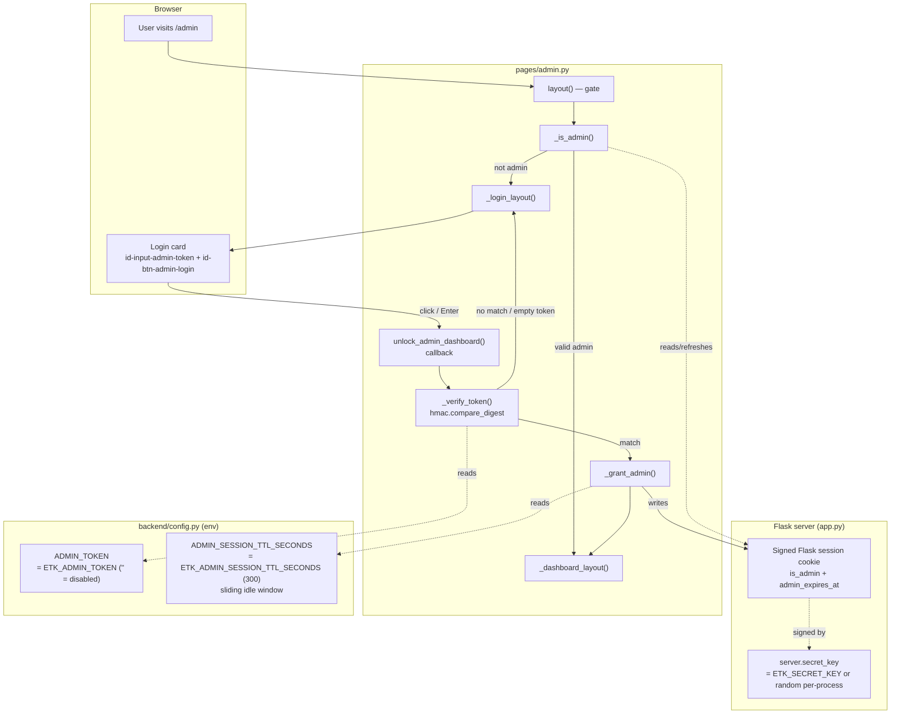
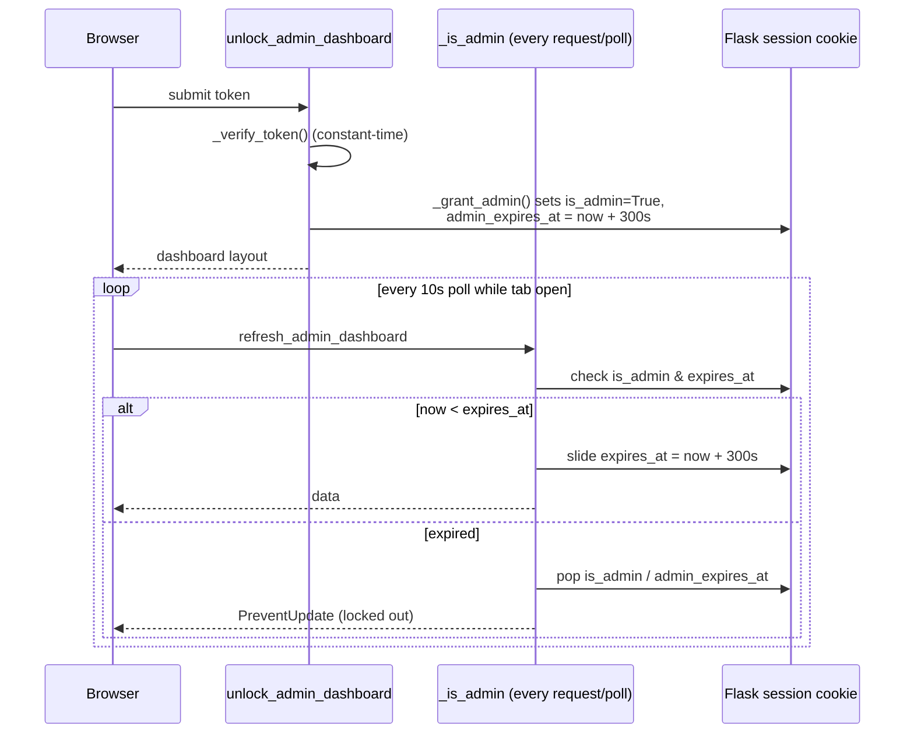

# Admin Login — Architecture & Dev Notes

The hidden `/admin` dashboard is gated behind a shared token. This document
explains how authentication, session state, and the idle timeout work.

## Architecture Diagram

## Idle-Timeout Lifecycle

## Dev Notes

### Two independent secrets (both env-only, never committed)

- `ETK_ADMIN_TOKEN` → `config.py` `ADMIN_TOKEN` — the password the user types.
  Empty default = **fail-closed**: login can never succeed.
- `ETK_SECRET_KEY` → `SECRET_KEY` — signs the Flask session cookie so the
  `is_admin` flag cannot be forged. Unset → random per-process key in `app.py`
  (dev convenience; admins are logged out on restart).

`scripts/generate-env.sh` mints **fresh** values for both on every run — no flag
and no existing `.env` can preserve a secret, so re-running the script *is* the
rotation procedure. Its `--production` / `--local` flags, and the production mode
it carries forward from an existing `.env`, move `APP_IN_PRODUCTION_MODE` alone
and never touch either secret. Expect a rotation to log every admin out: the new
`ETK_SECRET_KEY` invalidates every outstanding session cookie and the new
`ETK_ADMIN_TOKEN` invalidates the old password.

### Auth flow (all in `pages/admin.py`)

1. `/admin` is **not** in the navbar — discoverable only by URL.
2. `layout()` calls `_is_admin()` and renders `_dashboard_layout()` or
   `_login_layout()`.
3. Submitting the token fires `unlock_admin_dashboard` (button click `n_clicks`
   or Enter `n_submit`).
4. `_verify_token()` uses `hmac.compare_digest` (constant-time, avoids timing
   attacks) and rejects when `ADMIN_TOKEN` is empty.
5. On success `_grant_admin()` writes `is_admin=True` and `admin_expires_at`
   into the signed Flask `session`.

### Sliding idle timeout

- `ADMIN_SESSION_TTL_SECONDS` (default 300s). Every authenticated check —
  including the dashboard's 10s poll — pushes `admin_expires_at` forward.
- When the tab closes, polling stops and access lapses after the window.
  `_is_admin()` pops the flags once `time.time() >= admin_expires_at`.
- The cookie is intentionally a **browser-session cookie** (not permanent) — it
  clears on browser close.

### Cookie flags — both cookies are always `Secure`

`app.py` sets `SESSION_COOKIE_SECURE = True` **unconditionally**, and
`backend/session.py` derives the anonymous `etk_session_id` cookie's flag from
that same Flask config key. So both the admin session cookie and the anonymous
one are always `Secure` + `HttpOnly` + `SameSite=Lax`. There is no
auto-detection and no env var — `session.py`'s `request.is_secure` fallback
exists only to keep `init_session` reusable elsewhere, and never runs here.

`APP_IN_PRODUCTION_MODE` is no exception: it gates the per-session job cap in
`utils/submission_limits.py` and nothing else, and must never gate these flags —
making them conditional would silently weaken every deployment that forgets to set
it, to spare local dev a tradeoff it already accepts (below).

Browsers treat `http://localhost` and `http://127.0.0.1` as trustworthy
origins and accept `Secure` cookies there, which is the only reason local
Docker works over plain HTTP. On any **other** plain-HTTP origin — a LAN IP, a
bare hostname — both cookies are silently dropped: the admin login appears to
succeed (the dashboard is the callback's return value) but the stat cards stay
blank forever, and every anonymous request mints a fresh session id so users
stop seeing their own jobs. Deploy behind a TLS-terminating reverse proxy.

### Security posture

- UI hiding is never the protection boundary. Every destructive callback
  (`refresh_admin_dashboard`, cancel/clear/purge) re-calls `_is_admin()`
  server-side and `raise PreventUpdate` if not admin.
- Fail-closed by default: no token configured → dashboard unreachable, which is
  the safe default for a public codebase.

### Tests

`tests/test_admin.py` patches `ADMIN_TOKEN`, asserts empty-token denial,
constant-time match, `is_admin`/`admin_expires_at` session writes, idle expiry,
and the sliding-window refresh. It calls the callbacks directly as Python
functions, so it proves the logic but never the browser.

To prove the dashboard actually works — token typed into the real form, cookie
surviving the round-trip, grids populating, Danger Zone dialogs firing — run
the **`check-admin` skill**. It drives a side-car container on port 8051 that
shares the running stack's Redis, so it never disturbs the app on 8050 and
still sees real job data.

## Key File References

| Concern | Location |
| --- | --- |
| Login page, callbacks, auth helpers | `enzyme_tk_app/app/pages/admin.py` |
| Secrets & TTL config | `enzyme_tk_app/app/backend/config.py` |
| Flask `secret_key` wiring | `enzyme_tk_app/app/app.py` |
| Tests | `enzyme_tk_app/app/tests/test_admin.py` |
| Browser check (login, cookie, grids, idle expiry) | `.claude/skills/check-admin/`, `docker-compose.check-admin.yml` |
| Env template / generator | `scripts/template.env`, `scripts/generate-env.sh` |
| Compose wiring (all three admin vars, `web` service only) | `docker-compose.yml` |
